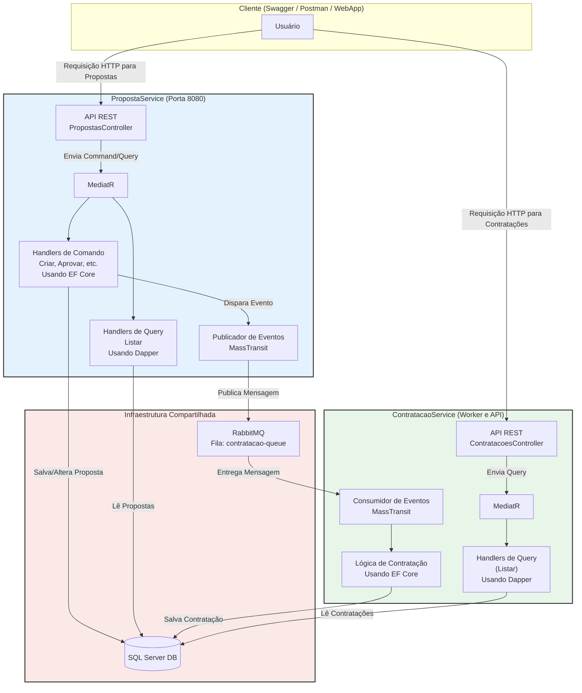

# Plataforma de Seguros - Arquitetura Hexagonal e CQRS

Este repositório contém a implementação de uma plataforma de seguros simplificada, desenvolvida com uma arquitetura moderna e robusta baseada em Microserviços, DDD, Arquitetura Hexagonal e CQRS.

O projeto permite criar e gerenciar propostas de seguro. Quando uma proposta é aprovada, um evento é disparado para que o serviço de contratação processe a efetivação do seguro de forma assíncrona.


````
+--------------------------------------------------------------------------------------------------+
|  🏦 Plataforma de Seguros                                                                        |
+--------------------------------------------------------------------------------------------------+
|                                                                                                  |
|   Propostas de Seguro                                                        [ + Nova Proposta ] |
|  +---------------------------------------------------------------------------------------------+ |
|  | NOME DO CLIENTE ▾ | VALOR DO SEGURO |    STATUS    |      MENSAGEM   |          AÇÕES       | |
|  |-------------------+-----------------+--------------+-----------------|----------------------+ |
|  | João da Silva     | R$ 2.500,00     | [ Aprovada ] |                 | [Editar]             | |
|  |-------------------+-----------------+--------------+-----------------|----------------------+ |
|  | Maria Oliveira    | R$ 1.800,00     | [Em Análise] |                 | [Aprovar][Rejeitar]| | |
|  |-------------------+-----------------+--------------+-----------------|----------------------+ |
|  | Pedro Martins     | R$ 3.200,00     | [ Rejeitada ]|                 |                      | |
|  +----------------------------------------------------------------------+----------------------+ |
|                                                                                                  |
+--------------------------------------------------------------------------------------------------+
````


Keywords: `Microserviços` `Arquitetura Hexagonal` `DDD` `CQRS` `MediatR` `C#` `.NET 8` `ASP.NET Core` `APIs REST` `Blazor WebAssembly (Standalone)` `Entity Framework Core` `Dapper` `Mensageria` `RabbitMQ` `MassTransit` `SQL Server` `Migrations` `xUnit` `Teste unitário` `FluentAssertions` `Moq` `Docker` `Docker Compose`


## :books: Arquitetura e Tecnologias

A solução é composta por uma aplicação web e dois microserviços de backend, orquestrados para rodar em contêineres `Docker`.

* **Padrões de Arquitetura**: `Microserviços`, `Arquitetura Hexagonal (Ports & Adapters)`, `DDD`, `CQRS` com `MediatR`.
* **Backend**: `C#` com `.NET 8`, `ASP.NET Core` para APIs REST.
* **Frontend**: `Blazor WebAssembly (Standalone)`.
* **Persistência**:
    * **`EF Core`**: Para o lado de escrita (Commands), garantindo consistência e regras de negócio.
    * **`Dapper`**: Para o lado de leitura (Queries), garantindo máxima performance.
* **Mensageria**: `RabbitMQ` para comunicação assíncrona entre os serviços, `MassTransit` (abstração para mensageria no .NET).
* **Banco de Dados**: `SQL Server` com uso de `Migrations`.
* **Testes**: `xUnit` (framework de testes), `FluentAssertions` (para asserções legíveis), `Moq` (para mocking de dependências)
* **Containerização**: `Docker` e `Docker Compose`.

### Diagrama da Arquitetura Final

O diagrama abaixo ilustra a interação entre todos os componentes do sistema, representando a arquitetura final:



<details>
	<summary> Se não for possivel visualizar o diagrama, clique aqui</summary>


 
</details>


## Descricão geral do projeto


📌 O que é o sistema?

O sistema é uma aplicação distribuída para gestão de propostas e contratações.
Ele é composto por dois serviços principais (`PropostaService` e `ContratacaoService`) que interagem via mensageria (`RabbitMQ`) e usam um banco de dados SQL Server como persistência compartilhada.

A ideia central:
O usuário (via `Swagger`, `Postman` ou `WebApp`) faz requisições para criar, aprovar ou consultar propostas.
As propostas geram eventos que disparam um fluxo de contratação assíncrono, tratado por outro serviço.

📌 Arquitetura geral

O sistema segue princípios de arquitetura em camadas e comunicação assíncrona.
Temos três blocos principais:

	 1. Cliente (Swagger / Postman / WebApp)
 		- Onde o usuário interage via requisições HTTP.
   		- Pode ser um sistema externo, um frontend ou ferramenta de testes.
	 2. Serviços de Negócio
  		- PropostaService (porta 8080)
			- Camada exposta via API REST.
   			- Responsável por criar, aprovar e consultar propostas.
	  		- Usa MediatR para aplicar o padrão CQRS (separação de comandos e queries).
	 		  - Commands (handlers de escrita) → usam EF Core para salvar/alterar propostas.
	  		  - Queries (handlers de leitura) → usam Dapper para consultas otimizadas.
	   		- Quando ocorre uma alteração relevante (ex: aprovação de proposta), um evento é publicado via MassTransit para o RabbitMQ.
	    - ContratacaoService (Worker)
	 		- Expõe API HTTP (para melhor visualização), porém é um serviço background (worker).
			- Consome eventos do RabbitMQ (ex: "PropostaAprovada").
   			- Processa a lógica de contratação usando EF Core.
	  		- Persiste as informações de contratação no mesmo SQL Server.
	 3. Infraestrutura Compartilhada
  		- Banco de Dados (SQL Server)
			- Usado tanto para propostas quanto para contratações.
   		- RabbitMQ
	 		- Fila "contratacao-queue" que transporta mensagens/eventos entre os serviços.

📌 Fluxo resumido (exemplo: criar e aprovar proposta):

- O usuário envia uma requisição `HTTP` (`POST` /propostas).
- A `API REST` (`Controller`) recebe e envia o comando ao Mediator.
- O Mediator encaminha para o handler de Command (`EF Core`) que grava a proposta no banco.
- Quando a proposta é aprovada, o handler dispara um evento para o Publisher (`MassTransit`).
- O Publisher envia o evento para o `RabbitMQ`.
- O Consumer (`ContratacaoService`) recebe a mensagem.
- O ContratacaoService executa a lógica de contratação e grava no banco (`EF Core`).
- O fluxo se conclui de forma assíncrona, sem bloquear a experiência do usuário.


📌 Padrões e boas práticas aplicadas

`CQRS` (Command Query Responsibility Segregation):
- Separação clara entre operações de escrita (`Commands + EF Core`) e leitura (`Queries + Dapper`).

Mediator Pattern (via `MediatR`):
- Evita que os Controllers chamem diretamente os handlers, centralizando a orquestração.

`Event-driven Architecture` (`EDA`):
- A contratação é disparada por eventos publicados no `RabbitMQ`, promovendo baixo acoplamento entre serviços.

`MassTransit`:
- Abstrai a comunicação com o `RabbitMQ`, simplificando publicação e consumo de mensagens.

Banco relacional centralizado (`SQL Server`):
- Usado como persistência confiável, tanto para propostas quanto contratações.


📌 Benefícios dessa arquitetura

Escalabilidade:
- O PropostaService pode escalar horizontalmente para atender mais requisições HTTP.
- O ContratacaoService pode escalar para consumir mais mensagens da fila.

Resiliência:
- Se o ContratacaoService estiver fora do ar, as mensagens ficam retidas no RabbitMQ até ele voltar.

Separação de responsabilidades:
- PropostaService → gestão de propostas.
- ContratacaoService → fluxo de contratação.

Flexibilidade:
- Fácil adicionar novos consumidores de eventos no futuro (ex: faturamento, notificação, auditoria).


👉 Em resumo:
O sistema é uma aplicação orientada a eventos, que aplica CQRS para manipulação de dados e usa RabbitMQ + MassTransit para integração assíncrona entre serviços. Ele garante desacoplamento, escalabilidade e manutenibilidade, sendo ideal para cenários de alto volume de propostas e contratações.


📌 Fluxo narrado
- O usuário chama `POST` `/api/propostas` → cria proposta pendente no banco.
- O usuário chama `POST` `/api/propostas/{id}/aprovar`.
- O handler muda status para "Aprovada".
- Publica evento PropostaAprovadaEvent no `RabbitMQ`.
- O ContratacaoService consome o evento da fila.
- Cria uma nova Contratação no banco.
- Se o usuário quiser consultar, chama `GET` `/api/propostas` e o `Dapper` retorna os registros.


## :books: Pré-requisitos

> [!IMPORTANT]
> Para executar este projeto, você precisará ter instalado:

* [.NET 8 SDK](https://dotnet.microsoft.com/download/dotnet/8.0)
* [Visual Studio 2022](https://visualstudio.microsoft.com/downloads/) (ou outra IDE de sua preferência)
* [Docker Desktop](https://www.docker.com/products/docker-desktop/)
* [Postman](https://www.postman.com/downloads/) (opcional para testes de API)


## Estrutura do Projeto

O projeto está organizado da seguinte forma:
```
/docker-compose.yml
/InsurancePlatform.sln
/src
|-- PropostaService
|   |-- PropostaService.Api/              (Driving Adapter: Controllers, Program.cs)
|   |-- PropostaService.Application/      (Application Core: Use Cases, DTOs, Ports)
|   |-- PropostaService.Domain/           (Domain Core: Entities, Enums, Business Rules)
|    `-- PropostaService.Infrastructure/  (Driven Adapters: Repository, EF Core)
|
`-- ContratacaoService
|   |-- ContratacaoService.Api/
|   |-- ContratacaoService.Application/
|   |-- ContratacaoService.Domain/
|    `--ContratacaoService.Infrastructure/
|
`-- Shared
|   |-- InsurancePlatform.Contracts
|    `-- InsurancePlatform.Shared
|
`-- WebApp
|   `-- InsurancePlatform.WebApp
|
`-- tests
|-- | -- PropostaService.UnitTests/
     `-- ContratacaoService.UnitTests/
```


# :writing_hand: Como Executar o Projeto Completo

**Primeiro clone o repositório**

```powershell
git clone https://github.com/roodriiigooo/InsurancePlatform.git
cd InsurancePlatform
```


## :bookmark_tabs: **Opção 1**: Ambiente Completo com Docker Compose
> [!TIP]
> A maneira mais simples e recomendada de executar toda a stack é utilizando Docker Compose.


1.  **Inicie os contêineres**
    Na raiz do projeto (onde o arquivo `docker-compose.yml` está localizado), execute o seguinte comando:
    ```powershell
    docker-compose up --build -d
    ```
    O comando `--build` garante que as imagens Docker para os seus serviços serão construídas. Na primeira vez, isso pode levar alguns minutos.

2.  **Acesse os Serviços**
após a conclusão do build e a inicialização dos contêineres, os serviços estarão disponíveis nos seguintes endereços:

    * 🌐 **Aplicação Web (Frontend)**: [http://localhost:8082](http://localhost:8082)
    * ⚙️ **API do PropostaService**: [http://localhost:8080](http://localhost:8080) / [http://localhost:8080/swagger/index.html](http://localhost:8080/swagger/index.html) 
	* ⚙️ **API do ContratacoService**: [http://localhost:8081](http://localhost:8081) / [http://localhost:8081/swagger/index.html](http://localhost:8081/swagger/index.html) 
    * 🐇 **RabbitMQ Management UI**: [http://localhost:15672](http://localhost:15672) (login: `guest` / senha: `guest`)


## :bookmark_tabs: **Opção 2**: Ambiente Híbrido (Debug com Visual Studio)
> [!TIP]
> Esta abordagem é ideal para o desenvolvimento e depuração do código .NET.


1. **Inicie a Infraestrutura**: Abra um terminal na pasta raiz do projeto e inicie o banco de dados e o RabbitMQ em segundo plano com o Docker:

````powershell
docker-compose up -d proposta-db rabbitmq
````

2. **Abra no Visual Studio**: Abra o arquivo `InsurancePlatform.sln` no `Visual Studio`.
3. **Configure a Inicialização Múltipla:**
   - Clique com o botão direito na Solução > "**Definir Projetos de Inicialização...**"
   - Marque "Vários projetos de inicialização".
   - Defina a Ação como "Iniciar" para os três projetos: `PropostaService.Api`, `ContratacaoService.Api` e `InsurancePlatform.WebApp`.
4. **Execute**: Pressione `F5` ou o botão "`Iniciar`". O Visual Studio irá compilar e iniciar os três projetos.

5.  **Acesse os Serviços**
após a conclusão do build e a inicialização dos contêineres, os serviços estarão disponíveis nos seguintes endereços:

    * 🌐 **Aplicação Web (Frontend)**: [http://localhost:7189](http://localhost:7189)
    * ⚙️ **API do PropostaService**: [http://localhost:7999](http://localhost:7999) / [http://localhost:7999/swagger/index.html](http://localhost:7999/swagger/index.html) 
	* ⚙️ **API do ContratacoService**: [http://localhost:7285](http://localhost:7285) / [http://localhost:7285/swagger/index.html](http://localhost:7285/swagger/index.html) 
    * 🐇 **RabbitMQ Management UI**: [http://localhost:15672](http://localhost:15672) (login: `guest` / senha: `guest`)

> [!NOTE]
> A WebApp estará acessível no seu endereço de debug (ex: https://localhost:7189).
> A API do PropostaService estará no seu endereço de debug (ex: https://localhost:7999).
> A API do ContratacaoService estará no seu endereço de debug (ex: https://localhost:7285).


# :page_with_curl: Como Executar os Testes Unitários

Para rodar a suíte de testes unitários, execute o seguinte comando na raiz do projeto:
```bash
dotnet test
```
ou no `Visual Studio`, vá em `Teste` > `Executar todos os Testes`


# :page_with_curl: Pipeline Ci/CD (Github Actions - Para AWS e AZURE)


#### 1. AWS

> [!NOTE]
> Esta sessão descreve um pipeline completo e robusto usando `GitHub Actions` que consome serviços `AWS`.

Este pipeline irá automaticamente:
- Executar os testes para garantir a qualidade do código.
- Construir as imagens `Docker` de cada microserviço que foi modificado.
- Enviar as imagens para um registro de contêineres na `AWS` (`Amazon ECR`).
- Implantar (fazer o deploy) de nova versões de serviço na `AWS` (`Amazon ECS`) sem interrupção.


### Fase 1: Preparando a Pista de Pouso na AWS (Configuração Única)

Antes de rodar o pipeline, precisamos configurar os serviços na `AWS` que receberão nossa aplicação. Esta configuração é feita apenas uma vez.

|Passo  	     | Ação na AWS                   | Propósito                   |
|----------------|-------------------------------|-----------------------------|
|1. Repositório de Imagens| No serviço `Amazon ECR` (`Elastic Container Registry`), crie três repositórios privados. Dê a eles nomes simples, como: propostaservice, contratacaoservice, webapp. |Será o "depósito" onde o `GitHub Actions` guardará as imagens `Docker` de cada um dos seus serviços.|
|2. Cluster de Contêineres| No serviço `Amazon ECS` (`Elastic Container Service`), crie um novo Cluster. Escolha o modelo "Somente Rede" (`Networking only`), que é a base para o `Fargate`. | É o "condomínio" onde nossos contêineres irão rodar. |
|3. "Plantas" dos Contêineres| No `ECS`, vá em "`Task Definitions`" e crie uma "`Task Definition`" para cada um dos seus três serviços (`propostaservice`, `contratacaoservice`, `webapp`). Configure o uso de CPU/Memória e aponte para a imagem no `ECR`. | A "`Task Definition`" é a planta baixa do seu contêiner: diz quanta memória ele precisa, qual imagem usar, etc. |
|4. Serviços em Execução | No `ECS`, dentro do seu cluster, crie um Serviço para cada "`Task Definition`". Configure-o para usar o tipo de inicialização `FARGATE` e associe-o a um Load Balancer se necessário (para o propostaservice). | O "Serviço" é o que garante que seu contêiner esteja sempre rodando. Se ele falhar, o serviço o reinicia automaticamente. |
|5. Usuário de Automação | No serviço `IAM` (`Identity and Access Management`), crie um novo Usuário. Marque a opção "`Access key - Programmatic access`". Dê a ele permissões para interagir com `ECR` e `ECS`. Guarde a `Access Key ID` e a `Secret Access Key` em um local seguro. | Este será o "robô" que o GitHub Actions usará para se autenticar na sua conta AWS e poder enviar as imagens e atualizar os serviços. |


### Fase 2: Configurando os Segredos no GitHub

> [!IMPORTANT]
> **NUNCA** coloque suas chaves da AWS diretamente no código, para isso, usar o gerenciador de segredos do GitHub.

1. Vá para o seu repositório/fork no GitHub.
2. Clique em "`Settings`" > "`Secrets and variables`" > "`Actions`".
3. Clique em "`New repository secret`" e crie os dois segredos a seguir:
	- Nome: `AWS_ACCESS_KEY_ID`
 	- Valor: Cole a `Access Key ID` do usuário `IAM` que você criou.
  	- Nome: `AWS_SECRET_ACCESS_KEY`
   	- Valor: Cole a Secret Access Key do usuário `IAM`.


### Fase 3: Os Arquivos de Pipeline (Workflows)
> A melhor prática para um monorepo é ter um arquivo de workflow para cada serviço, assim, uma alteração no `PropostaService` não aciona o pipeline do `WebApp`.

Na raiz do projeto, há uma pasta chamada `.github` e, dentro dela, uma pasta chamada `workflows`. Três arquivos YAML foram gerados dentro de `.github/workflows`: `ContratacaoService_AWS.yaml`, `PropostaService_AWS.yaml`, `WebApp_AWS.yaml`

Eu preparei os arquivos completos, eles são inteligentes e só serão executados quando houver uma alteração na pasta do respectivo serviço.


#### 2. AZURE

> [!NOTE]
> Esta sessão descreve um pipeline completo e robusto usando `GitHub Actions` que consome serviços `AZURE`.

A estratégia deste pipeline é:
- **Contêineres**: Usar o `Azure Container Apps`, o serviço moderno e sem servidor do `Azure` para `contêineres` que é o equivalente ao `AWS Fargate`.
- **Banco de Dados**: Usar o `Azure SQL Database`, o serviço gerido para `SQL Server`.
- **Mensageria**: Usar o `Azure Service Bus`, o serviço de mensageria nativo e robusto do `Azure`, ou manter o `RabbitMQ` rodando como outro contêiner no `Azure Container Apps`. Para este pipeline, mantenh o `RabbitMQ` para não alterar o código da aplicação.
- **Frontend**: Usar o `Azure Static Web Apps`, que é otimizado para hospedar frontends estáticos como o `Blazor WebAssembly` e integrá-los com `APIs`.


### Fase 1: Preparando a Pista de Pouso no Azure (Configuração Única)
> Antes de rodar o pipeline, precisamos configurar os serviços no portal do `Azure`.


|Passo  	     | Ação no Portal Azure	                   | Propósito                   |
|----------------|-------------------------------|-----------------------------|
|1. Grupo de Recursos|Crie um novo Grupo de Recursos (`Resource Group`). Ex: `rg-insurance-platform`.|É uma "pasta" lógica no Azure para organizar todos os recursos do nosso projeto.|
|2. Registo de Contêiner|Crie um Registo de Contêiner do Azure (`Azure Container Registry - ACR`). Ex: `acrinsuranceplatform`.|O nosso "depósito" privado no Azure para guardar as imagens Docker.|
|3. Banco de Dados|Crie um Banco de Dados SQL do Azure (`Azure SQL Database`). Durante a criação, será criado também um servidor SQL. Guarde o nome do servidor, o nome da base de dados, o utilizador e a senha.|O nosso serviço de SQL Server totalmente gerenciado.|
|4. Ambiente de Contêiner	|Crie um Ambiente do Azure Container Apps (`Azure Container Apps Environment`).	|É a rede privada e segura onde os nossos contêineres irão comunicar entre si.|
|5. Aplicações de Contêiner|No ambiente que acabou de criar, crie três Aplicações de Contêiner (Container Apps): `propostaservice`, `contratacaoservice` e `rabbitmq`. Configure-os para usar uma imagem inicial qualquer (será substituída pelo pipeline) e defina as variáveis de ambiente necessárias (como a `SA_PASSWORD` para o `RabbitMQ`).|Estes são os serviços que irão executar os nossos contêineres de backend e de mensageria.|
|6. Aplicação Web Estática	|Crie uma Aplicação Web Estática (`Static Web App`). Ligue-a ao seu repositório `GitHub`, mas na seção de "`Build`", escolha a opção "`Personalizado`" (`Custom`), pois o nosso `Blazor` é `standalone`.|Este serviço irá hospedar a nossa interface de utilizador (`Blazor`) e distribuí-la globalmente.|
|7. "Robô" de Automação	|No `Azure Active Directory` > `Registos de aplicações`, crie uma nova `Entidade de Serviço `(`Service Principal`). Atribua a ela a função de "`Colaborador`" (`Contributor`) no seu Grupo de Recursos. Guarde o `clientId`, `clientSecret` e `tenantId`.|Este será o nosso "robô" para o GitHub Actions se autenticar no `Azure`.|


### Fase 2: Configurando os Segredos no GitHub
> [!IMPORTANT]
> **NUNCA** coloque suas chaves da AZURE diretamente no código, para isso, usar o gerenciador de segredos do GitHub.


1. Vá ao seu repositório/fork no `GitHub` > "`Settings`" > "`Secrets and variables`" > "`Actions`".
2. Clique em "`New repository secret`" e crie os seguintes segredos:
   - Nome: `AZURE_CREDENTIALS`
   - Valor: Cole o JSON completo da sua Entidade de Serviço (o Azure CLI gera isto para si com o comando az ad sp create-for-rbac).
   - Nome: `ACR_USERNAME`
   - Valor: O `clientId` da sua Entidade de Serviço.
   - Nome: `ACR_PASSWORD`
   - Valor: O `clientSecret` da sua Entidade de Serviço.


### Fase 3: Os Arquivos de Pipeline (Workflows)
> A melhor prática para um monorepo é ter um arquivo de workflow para cada serviço, assim, uma alteração no `PropostaService` não aciona o pipeline do `WebApp`.

Na raiz do projeto, há uma pasta chamada `.github` e, dentro dela, uma pasta chamada `workflows`. Três arquivos YAML foram gerados dentro de `.github/workflows`: `ContratacaoService_AZURE.yaml`, `PropostaService_AZURE.yaml`, `WebApp_AZURE.yaml`

Eu preparei os arquivos completos, eles são inteligentes e só serão executados quando houver uma alteração na pasta do respectivo serviço.


# :art: Screenshots
<details>
	<summary># 1. WebApp</summary>

 


</details>

<details>
	<summary># 2. Testes</summary>

 


</details>

 
<details>
	<summary># 3. PropostaService.Api</summary>
 


</details>


 
<details>
	<summary># 4. ContratacaoService.Api</summary>


</details>


