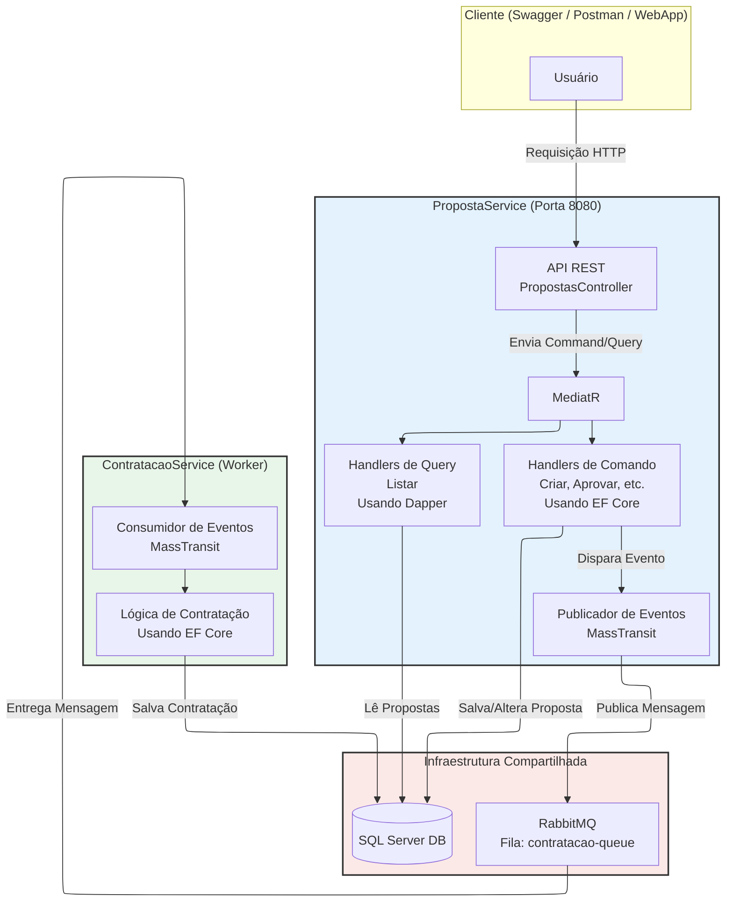

# Plataforma de Seguros - Arquitetura Hexagonal e CQRS

Este repositório contém a implementação de uma plataforma de seguros simplificada, desenvolvida com uma arquitetura moderna e robusta baseada em Microserviços, DDD, Arquitetura Hexagonal e CQRS.

O projeto permite criar e gerenciar propostas de seguro. Quando uma proposta é aprovada, um evento é disparado para que o serviço de contratação processe a efetivação do seguro de forma assíncrona.


````
+--------------------------------------------------------------------------------------------------+
|  🏦 Plataforma de Seguros                                                                        |
+--------------------------------------------------------------------------------------------------+
|                                                                                                  |
|   Propostas de Seguro                                                        [ + Nova Proposta ] |
|  +---------------------------------------------------------------------------------------------+ |
|  | NOME DO CLIENTE ▾ | VALOR DO SEGURO |    STATUS    |      MENSAGEM   |          AÇÕES       | |
|  |-------------------+-----------------+--------------+-----------------|----------------------+ |
|  | João da Silva     | R$ 2.500,00     | [ Aprovada ] |                 | [Editar]             | |
|  |-------------------+-----------------+--------------+-----------------|----------------------+ |
|  | Maria Oliveira    | R$ 1.800,00     | [Em Análise] |                 | [Aprovar][Rejeitar]| | |
|  |-------------------+-----------------+--------------+-----------------|----------------------+ |
|  | Pedro Martins     | R$ 3.200,00     | [ Rejeitada ]|                 |                      | |
|  +----------------------------------------------------------------------+----------------------+ |
|                                                                                                  |
+--------------------------------------------------------------------------------------------------+
````


Keywords: `Microserviços` `Arquitetura Hexagonal` `DDD` `CQRS` `MediatR` `C#` `.NET 8` `ASP.NET Core` `APIs REST` `Blazor WebAssembly (Standalone)` `Entity Framework Core` `Dapper` `Mensageria` `RabbitMQ` `MassTransit` `SQL Server` `Migrations` `xUnit` `Teste unitário` `FluentAssertions` `Moq` `Docker` `Docker Compose`


## :books: Arquitetura e Tecnologias

A solução é composta por uma aplicação web e dois microserviços de backend, orquestrados para rodar em contêineres `Docker`.

* **Padrões de Arquitetura**: `Microserviços`, `Arquitetura Hexagonal (Ports & Adapters)`, `DDD`, `CQRS` com `MediatR`.
* **Backend**: `C#` com `.NET 8`, `ASP.NET Core` para APIs REST.
* **Frontend**: `Blazor WebAssembly (Standalone)`.
* **Persistência**:
    * **`EF Core`**: Para o lado de escrita (Commands), garantindo consistência e regras de negócio.
    * **`Dapper`**: Para o lado de leitura (Queries), garantindo máxima performance.
* **Mensageria**: `RabbitMQ` para comunicação assíncrona entre os serviços, `MassTransit` (abstração para mensageria no .NET).
* **Banco de Dados**: `SQL Server` com uso de `Migrations`.
* **Testes**: `xUnit` (framework de testes), `FluentAssertions` (para asserções legíveis), `Moq` (para mocking de dependências)
* **Containerização**: `Docker` e `Docker Compose`.

### Diagrama da Arquitetura Final

O diagrama abaixo ilustra a interação entre todos os componentes do sistema, representando a arquitetura final:



<details>
	<summary> Se não for possivel visualizar o diagrama, clique aqui</summary>


 
</details>


## :books: Pré-requisitos

> [!IMPORTANT]
> Para executar este projeto, você precisará ter instalado:

* [.NET 8 SDK](https://dotnet.microsoft.com/download/dotnet/8.0)
* [Visual Studio 2022](https://visualstudio.microsoft.com/downloads/) (ou outra IDE de sua preferência)
* [Docker Desktop](https://www.docker.com/products/docker-desktop/)
* [Postman](https://www.postman.com/downloads/) (opcional para testes de API)


## Estrutura do Projeto

O projeto está organizado da seguinte forma:
```
/docker-compose.yml
/InsurancePlatform.sln
/src
|-- PropostaService
|   |-- PropostaService.Api/              (Driving Adapter: Controllers, Program.cs)
|   |-- PropostaService.Application/      (Application Core: Use Cases, DTOs, Ports)
|   |-- PropostaService.Domain/           (Domain Core: Entities, Enums, Business Rules)
|    `-- PropostaService.Infrastructure/  (Driven Adapters: Repository, EF Core)
|
`-- ContratacaoService
|   |-- ContratacaoService.Api/
|   |-- ContratacaoService.Application/
|   |-- ContratacaoService.Domain/
|    `--ContratacaoService.Infrastructure/
|
`-- Shared
|   |-- InsurancePlatform.Contracts
|    `-- InsurancePlatform.Shared
|
`-- WebApp
|   `-- InsurancePlatform.WebApp
|
`-- tests
|-- | -- PropostaService.UnitTests/
     `-- ContratacaoService.UnitTests/
```


# :writing_hand: Como Executar o Projeto Completo

**Primeiro clone o repositório**

```powershell
git clone https://github.com/roodriiigooo/InsurancePlatform.git
cd InsurancePlatform
```


## :bookmark_tabs: **Opção 1**: Ambiente Completo com Docker Compose
> [!TIP]
> A maneira mais simples e recomendada de executar toda a stack é utilizando Docker Compose.


1.  **Inicie os contêineres**
    Na raiz do projeto (onde o arquivo `docker-compose.yml` está localizado), execute o seguinte comando:
    ```powershell
    docker-compose up --build -d
    ```
    O comando `--build` garante que as imagens Docker para os seus serviços serão construídas. Na primeira vez, isso pode levar alguns minutos.

2.  **Acesse os Serviços**
após a conclusão do build e a inicialização dos contêineres, os serviços estarão disponíveis nos seguintes endereços:

    * 🌐 **Aplicação Web (Frontend)**: [http://localhost:8082](http://localhost:8082)
    * ⚙️ **API do PropostaService**: [http://localhost:8080](http://localhost:8080) / [http://localhost:8080/swagger/index.html](http://localhost:8080/swagger/index.html) 
	* ⚙️ **API do ContratacoService**: [http://localhost:8081](http://localhost:8081) / [http://localhost:8081/swagger/index.html](http://localhost:8081/swagger/index.html) 
    * 🐇 **RabbitMQ Management UI**: [http://localhost:15672](http://localhost:15672) (login: `guest` / senha: `guest`)


## :bookmark_tabs: **Opção 2**: Ambiente Híbrido (Debug com Visual Studio)
> [!TIP]
> Esta abordagem é ideal para o desenvolvimento e depuração do código .NET.


1. **Inicie a Infraestrutura**: Abra um terminal na pasta raiz do projeto e inicie o banco de dados e o RabbitMQ em segundo plano com o Docker:

````powershell
docker-compose up -d proposta-db rabbitmq
````

2. **Abra no Visual Studio**: Abra o arquivo `InsurancePlatform.sln` no `Visual Studio`.
3. **Configure a Inicialização Múltipla:**
   - Clique com o botão direito na Solução > "**Definir Projetos de Inicialização...**"
   - Marque "Vários projetos de inicialização".
   - Defina a Ação como "Iniciar" para os três projetos: `PropostaService.Api`, `ContratacaoService.Api` e `InsurancePlatform.WebApp`.
4. **Execute**: Pressione `F5` ou o botão "`Iniciar`". O Visual Studio irá compilar e iniciar os três projetos.

5.  **Acesse os Serviços**
após a conclusão do build e a inicialização dos contêineres, os serviços estarão disponíveis nos seguintes endereços:

    * 🌐 **Aplicação Web (Frontend)**: [http://localhost:7189](http://localhost:7189)
    * ⚙️ **API do PropostaService**: [http://localhost:7999](http://localhost:7999) / [http://localhost:7999/swagger/index.html](http://localhost:7999/swagger/index.html) 
	* ⚙️ **API do ContratacoService**: [http://localhost:7285](http://localhost:7285) / [http://localhost:7285/swagger/index.html](http://localhost:7285/swagger/index.html) 
    * 🐇 **RabbitMQ Management UI**: [http://localhost:15672](http://localhost:15672) (login: `guest` / senha: `guest`)

> [!NOTE]
> A WebApp estará acessível no seu endereço de debug (ex: https://localhost:7189).
> A API do PropostaService estará no seu endereço de debug (ex: https://localhost:7999).
> A API do ContratacaoService estará no seu endereço de debug (ex: https://localhost:7285).


# :page_with_curl: Como Executar os Testes Unitários

Para rodar a suíte de testes unitários, execute o seguinte comando na raiz do projeto:
```bash
dotnet test
```
ou no `Visual Studio`, vá em `Teste` > `Executar todos os Testes`


# :art: Screenshots
<details>
	<summary># 1. WebApp</summary>

 


</details>

<details>
	<summary># 2. Testes</summary>

 


</details>

 
<details>
	<summary># 3. PropostaService.Api</summary>
 


</details>


 
<details>
	<summary># 4. ContratacaoService.Api</summary>


</details>


